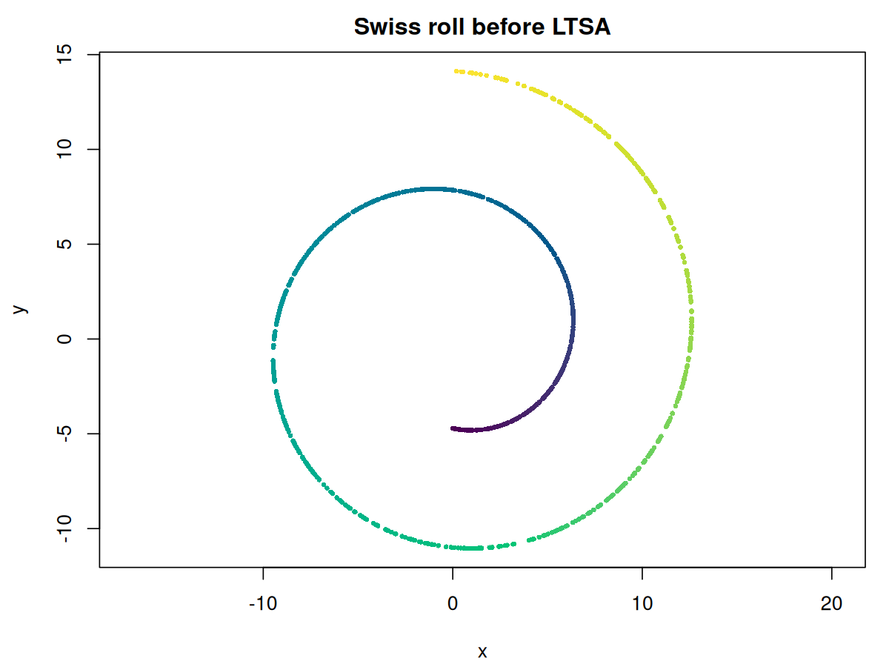
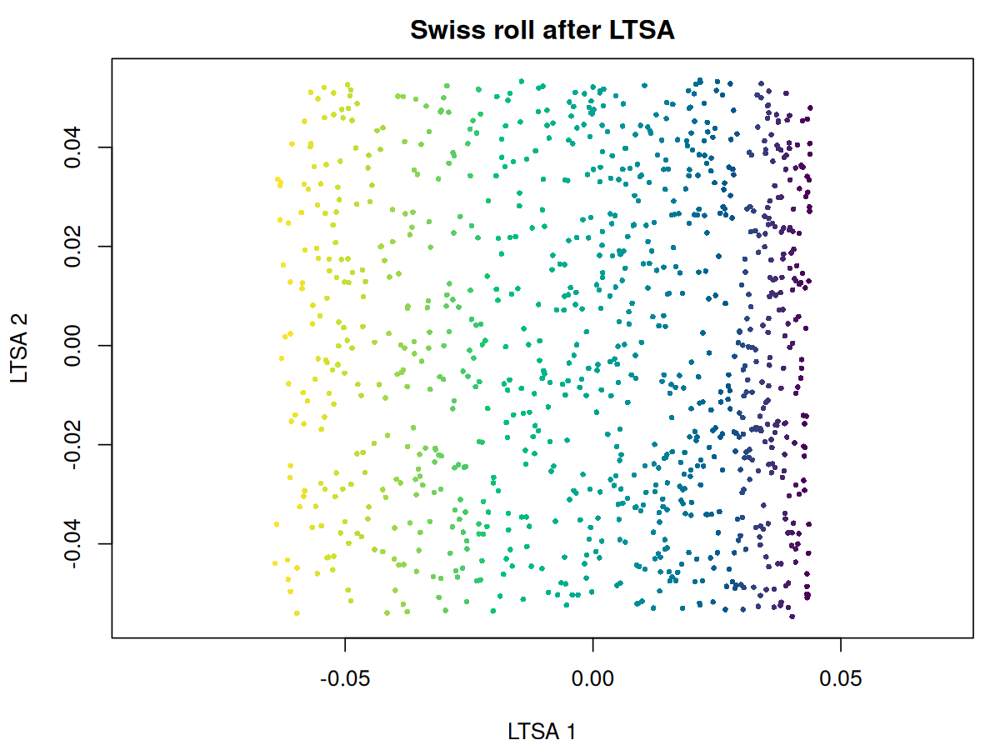

# flotsam

Fast LOcal Tangent Space Alignment Method

<!-- badges: start -->
[](https://github.com/jlmelville/flotsam/actions/workflows/R-CMD-check.yaml)
[](https://github.com/jlmelville/flotsam/actions/workflows/air.yaml)
[](https://github.com/jlmelville/flotsam/actions/workflows/lint.yaml)
[](https://app.codecov.io/gh/jlmelville/flotsam?branch=main)
<!-- badges: end -->

An implementation of the [Local Tangent Space Alignment](https://doi.org/10.1137/S1064827502419154)
method (Zhang & Zha, 2004), a spectral method for dimensionality reduction. It is one of the few
methods that can unroll the "swiss roll" data set and its variants without major distortion. I
consider this implementation "Fast" because of its use of approximate nearest neighbors. Internally
it works with sparse matrices and does not require calculating all eigenvectors, so can scale to
large datasets.

## Installation

``` r
# install.packages("pak")
pak::pak("jlmelville/flotsam")
```

## Example

``` r
library(flotsam)

# Create a "swiss roll": 2D rectangle rolled up in 3D
n <- 1000
max_z <- 10

# phi represents the position along the roll
phi <- stats::runif(n, min = 1.5 * pi, max = 4.5 * pi)
x <- phi * cos(phi)
y <- phi * sin(phi)
z <- stats::runif(n, max = max_z)
swiss_roll <- data.frame(x, y, z)

# See side section to prove it's rolled
plot(swiss_roll$x, swiss_roll$y, col = phi)

# unroll it
swiss_unrolled <- ltsa(swiss_roll, verbose = TRUE)
plot(swiss_unrolled, col = phi)
```

<p align="center">
  
  
</p>

## Current Status

*June 27 2026*: Version 0.0.0.9002 is a big re-write compared to the initial release, adding
multi-threaded C++ local-weight construction, triangular sparse matrix assembly, and Rayleigh-Ritz
postprocessing for more reliable final eigenanalysis.

## See Also

- [Rdimtools](https://github.com/kisungyou/Rdimtools) also contains an R implementation of LTSA.
- Eigenanalysis is carried out with either [RSpectra](https://cran.r-project.org/package=RSpectra)
or [irlba](https://cran.r-project.org/package=irlba).
- Approximate nearest neighbor analysis via [rnndescent](https://cran.r-project.org/package=rnndescent).

## Further Reading

A fairly arbitrary selection of papers that contained at least one thing I found interesting while
writing this package.

Zhang, Z., & Zha, H. (2004). 
Principal manifolds and nonlinear dimensionality reduction via tangent space alignment.
*SIAM journal on scientific computing*, *26*(1), 313-338.
<https://doi.org/10.1137/S1064827502419154>

Xiang, S., Nie, F., Pan, C., & Zhang, C. (2011).
Regression reformulations of LLE and LTSA with locally linear transformation. 
*IEEE Transactions on Systems, Man, and Cybernetics, Part B (Cybernetics)*, *41*(5), 1250-1262.
<https://doi.org/10.1109/TSMCB.2011.2123886>

Sun, W., Halevy, A., Benedetto, J. J., Czaja, W., Li, W., Liu, C., ... & Wang, R. (2013).
Nonlinear dimensionality reduction via the ENH-LTSA method for hyperspectral image classification.
*IEEE Journal of Selected Topics in Applied Earth Observations and Remote Sensing*, *7*(2), 375-388.
<https://doi.org/10.1109/JSTARS.2013.2238890>

Hong, D., Yokoya, N., & Zhu, X. X. (2017). 
Learning a robust local manifold representation for hyperspectral dimensionality reduction.
*IEEE Journal of Selected Topics in Applied Earth Observations and Remote Sensing*, *10*(6), 2960-2975.
<https://doi.org/10.1109/JSTARS.2017.2682189>

Zhang, S., Ma, Z., & Tan, H. (2017).
On the Equivalence of HLLE and LTSA.
*IEEE transactions on cybernetics*, *48*(2), 742-753.
<https://doi.org/10.1109/TCYB.2017.2655338>
