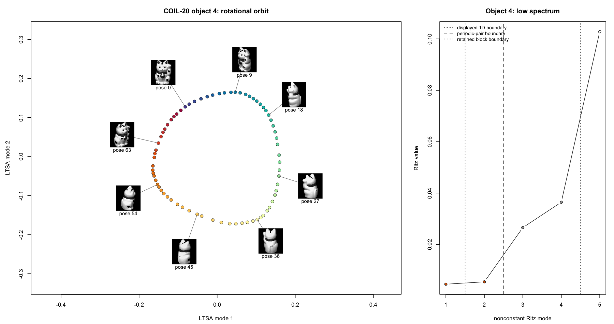
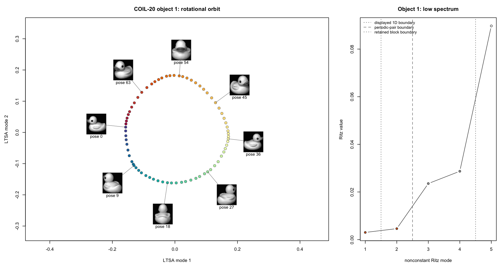
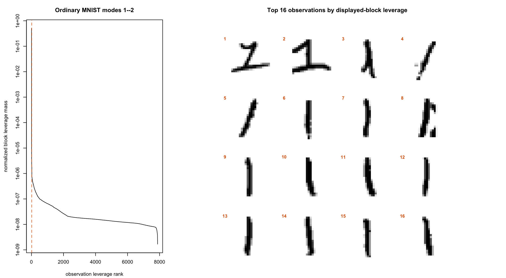
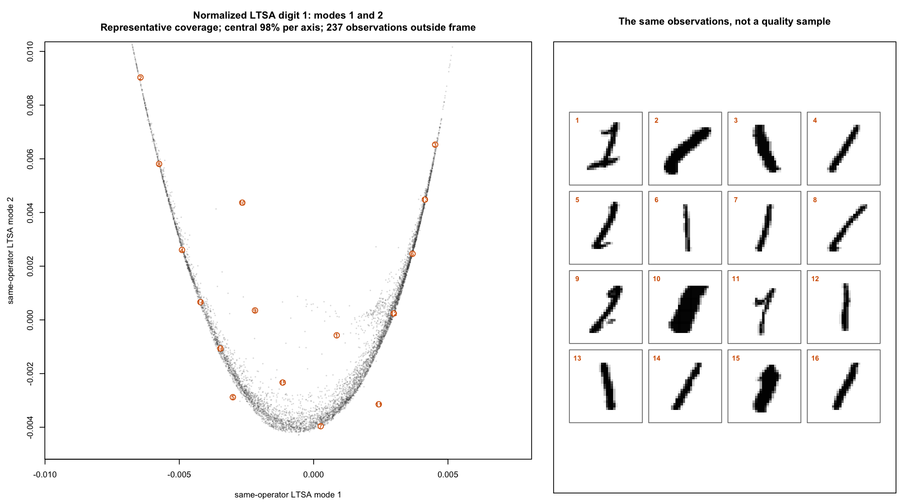
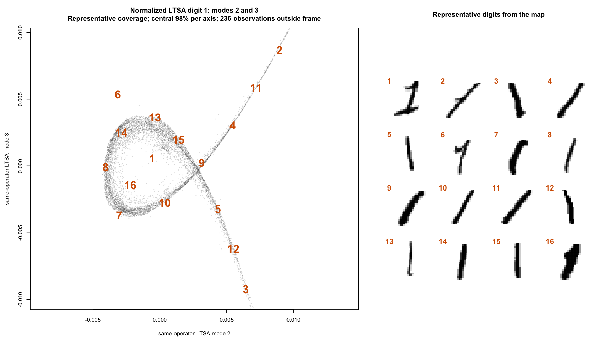
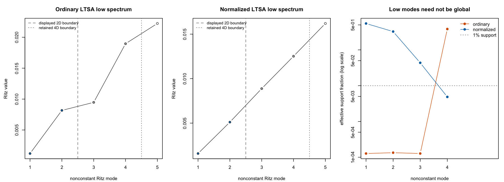
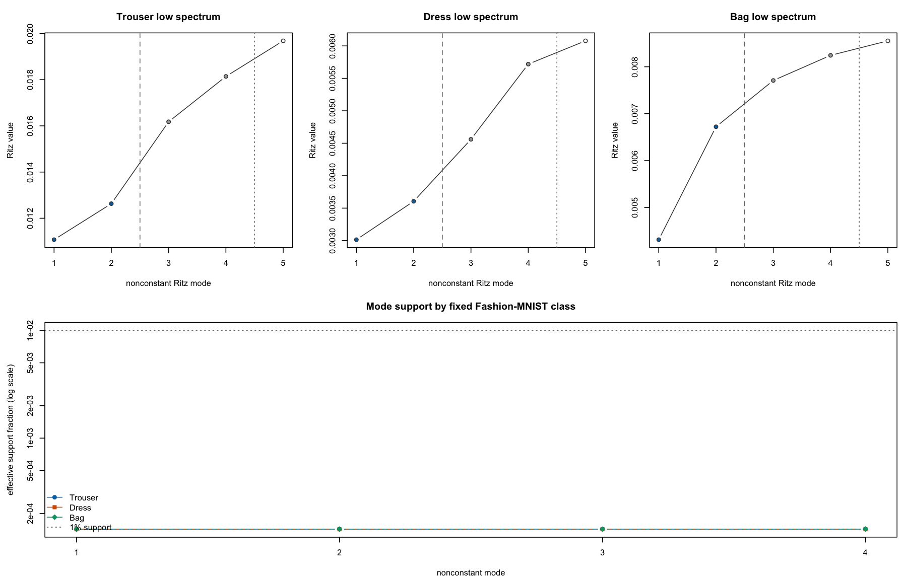

```{r setup, include=FALSE}
knitr::opts_chunk$set(
  collapse = TRUE,
  comment = "#>",
  fig.align = "center",
  fig.width = 11,
  fig.height = 7,
  dev.args = list(bg = "white")
)
library(flotsam)
```

LTSA uses `ndim` twice: once to build the local tangent spaces and again to
choose how many global coordinates to return. Those choices can differ. A
circle is locally one-dimensional, for example, but two coordinates show its
closed path.

`spectral_dim` retains extra coordinates from the same LTSA operator. This
article shows how to inspect them on a circle, COIL-20, MNIST, and
Fashion-MNIST.

Click any figure to open a larger version; click the enlarged image or press
Escape to close it. Keyboard users can focus a figure and press Enter or Space.

## Keep more modes from the same operator

Given a data matrix `X`, request four low-frequency modes while keeping a
two-dimensional local tangent model and a two-coordinate returned embedding:

```r
fit <- ltsa(
  X,
  ndim = 2,
  n_neighbors = 15,
  output = "result",
  spectral_dim = 4
)

dim(fit$embedding)                    # n by 2
dim(fit$spectral_embedding)           # n by 4
identical(
  fit$embedding,
  fit$spectral_embedding[, 1:2, drop = FALSE]
)
```

The calculation follows this pipeline:

```text
data + graph + ndim
        |
        v
  fixed operator B
        |
        v
 eig_k candidate modes
        |
        v
spectral_dim retained modes
        |
        v
 first ndim displayed
```

| Control | Changes `B`? | Purpose |
|---|:---:|---|
| `ndim` | yes | Sets the local tangent rank and displayed prefix |
| `spectral_dim` | no | Retains extra nonconstant modes from the fixed operator |
| `eig_k` | no | Gives the eigensolver a numerical candidate span |

Most users can leave `eig_k` at its default. When retaining an expanded block,
a manual request must be at least `spectral_dim + 2`: one place for the known
constant direction and another for the mode just beyond the retained block.

The displayed and retained boundaries have separate diagnostics:

```r
fit$eigen$diagnostics$scaled_boundary_gap
fit$eigen$spectral$diagnostics$scaled_boundary_gap
fit$eigen$status
fit$eigen$spectral$status
```

A boundary gap compares the last included mode with the next one. A large gap
isolates the chosen subspace. A small gap suggests interpreting the neighboring
modes together and checking their geometry and support.

## A short inspection routine

Three questions organize the diagnostics:

1. **Is the operator structurally sound?** Check graph connectivity and local
   ranks.
2. **Was the spectrum computed reliably?** Check status, messages, and
   residuals.
3. **Is the displayed view well determined and useful?** Check boundary gaps,
   inspect a small retained block, and measure how broadly each mode is
   supported.

When comparing stochastic fits, reuse the same fixed in-memory neighbor matrix,
reset the eigensolver seed immediately before each fit, and keep thread settings
equal.

## A circle needs a spectral pair

A circle has a one-dimensional tangent at every point. A single real-valued
coordinate cannot follow the whole loop continuously, so the first two
low-frequency modes work as a pair. Their signs and orientation can change
between fits; treat the two-dimensional span as the stable unit.

The example uses exact neighbors and dense eigenanalysis, making the repeated
pairs easy to see.

```{r circle-fit}
theta <- seq(0, 2 * pi, length.out = 721)[-721]
circle <- cbind(x = cos(theta), y = sin(theta))

circle_fit <- ltsa(
  circle,
  ndim = 1,
  n_neighbors = 9,
  nn_method = "exact",
  eig_method = "eig",
  eig_k = 8,
  output = "result",
  spectral_dim = 4
)

circle_fit$eigen$values
circle_fit$eigen$spectral$values
circle_fit$eigen$status
circle_fit$eigen$messages
```

```{r circle-witnesses, include=FALSE}
circle_pair <- circle_fit$spectral_embedding[, 1:2, drop = FALSE]
circle_pair_basis <- qr.Q(qr(circle_pair))
circle_target <- scale(circle, center = TRUE, scale = FALSE)
circle_target_residual <- circle_target -
  circle_pair_basis %*% crossprod(circle_pair_basis, circle_target)
circle_pair_gaps <- diff(circle_fit$eigen$ritz_values[1:3])

stopifnot(
  identical(
    circle_fit$embedding,
    circle_fit$spectral_embedding[, 1, drop = FALSE]
  ),
  sqrt(sum(circle_target_residual^2) / sum(circle_target^2)) < 1e-8,
  circle_pair_gaps[[2L]] > 100 * circle_pair_gaps[[1L]],
  circle_fit$eigen$status != "invalid",
  circle_fit$eigen$spectral$status != "invalid",
  circle_fit$assembly$component_count == 1L,
  circle_fit$assembly$rank_deficient_count == 0L,
  circle_fit$assembly$min_local_rank == 1L
)
```

```{r circle-figure, echo=FALSE, fig.cap="The input circle, its one-dimensional LTSA display, the first two modes from the same operator, and the low spectrum. The mode pair follows the complete periodic progression."}
circle_colors <- grDevices::hcl.colors(
  nrow(circle),
  # A cyclic palette makes the start and end of theta meet in color.
  palette = "Dynamic",
  rev = TRUE
)
circle_values <- circle_fit$eigen$ritz_values[1:5]

old_par <- graphics::par(no.readonly = TRUE)
graphics::par(mfrow = c(2, 2), mar = c(4, 4, 3, 1))

graphics::plot(
  circle,
  col = circle_colors,
  pch = 16,
  cex = 0.55,
  asp = 1,
  xlab = "input coordinate 1",
  ylab = "input coordinate 2",
  main = "Input circle"
)
graphics::plot(
  theta,
  circle_fit$embedding[, 1],
  col = circle_colors,
  pch = 16,
  cex = 0.55,
  xlab = "latent angle",
  ylab = "returned LTSA coordinate",
  main = "One displayed coordinate"
)
graphics::plot(
  circle_fit$spectral_embedding[, 1:2],
  col = circle_colors,
  pch = 16,
  cex = 0.55,
  asp = 1,
  xlab = "LTSA mode 1",
  ylab = "LTSA mode 2",
  main = "The first spectral pair"
)
graphics::plot(
  seq_along(circle_values),
  circle_values,
  type = "b",
  pch = 21,
  bg = c("#D55E00", "#D55E00", rep("grey80", 3)),
  xaxt = "n",
  xlab = "nonconstant Ritz mode",
  ylab = "Ritz value",
  main = "Low spectrum"
)
graphics::axis(1, at = seq_along(circle_values))
graphics::abline(
  v = c(1.5, 2.5, 4.5),
  lty = c(3, 2, 3),
  col = "grey40"
)
graphics::legend(
  "topleft",
  legend = c("displayed 1D", "first pair", "retained 4D"),
  lty = c(3, 2, 3),
  col = "grey40",
  bty = "n",
  cex = 0.75
)
graphics::par(old_par)
```

Setting `ndim = 2` would build a two-dimensional local tangent model. This fit
instead keeps `ndim = 1` and uses `spectral_dim = 4`: the first two retained
modes reveal the global coordinate pair, while the next two expose its
neighboring spectral context.

## COIL-20: a real periodic example

[COIL-20](https://cave.cs.columbia.edu/repository/COIL-20) contains 72 views of
each object as it rotates. One object traces a closed, locally one-dimensional
curve through pixel space, so the circle example predicts a spectral pair.

At `k = 7`, mixing objects produces a disconnected neighbor graph, so we fit
objects separately. Objects 4 and 1 were fixed by an earlier topology-only
screen run before any embedding. The screen required connected graphs,
bidirectional local pose coverage, wraparound support, and at most one-sixth
pose-order shortcut edges. Nine objects qualified, and ordering them by
shortcut rate selected objects 4 and 1. The companion below reproduces these
fixed-object fits and their spectral claims, not the earlier 20-object screen.
Each fit uses ordinary LTSA with `ndim = 1`, exact neighbors, and four retained
modes. The coordinates come from pixels; pose supplies the point colors and
thumbnail labels.





The gap after mode 2 is much larger than the gap between modes 1 and 2. For
objects 4 and 1, the mode 1--2 gaps are `0.000108` and `0.000181`, while the
mode 2--3 gaps are `0.00250` and `0.00215`---about 23 and 12 times larger. This
is the spectral pattern expected from a mode pair. The second mode completes
the rotational orbit already present in the fixed operator.

## Check whether a mode represents many observations

A low-energy mode can be dominated by a few observations. For a
Euclidean-normalized coordinate vector `v`, the effective support fraction is

$$
\frac{1}{n\sum_i v_i^4}.
$$

This is the normalized participation ratio. It equals $1/n$ when one
observation carries the mode, $r/n$ when the energy is spread equally across
exactly $r$ observations, and 1 when it is spread equally across all
observations. Here, a mode's energy means its squared coordinate values, `v^2`:

```r
effective_support_fraction <- function(v) {
  v <- v / sqrt(sum(v^2))
  1 / (length(v) * sum(v^4))
}
```

This scalar shows whether a coordinate is carried by many observations or only
a few. The plots then reveal the variation organized by a broadly supported
coordinate.

For a retained block, first orthonormalize its columns and let each
observation's block leverage be the sum of its squared entries across that
basis. Normalizing those leverages to sum to one gives the same effective
support formula for the whole span. This block support is unchanged by rotating
or rescaling coordinates within the span. It does not establish where the span
should end, so read it together with the boundary gap.

## MNIST: a complementary view

The 7,877 MNIST digit-1 images show how localization changes the interpretation
of extra modes. Ordinary and normalized LTSA reuse the same fixed neighbor
matrix, `ndim = 2`, `k = 15`, and four retained modes. Normalized LTSA changes
the weighting through a generalized eigenproblem, giving a distinct estimator
over the same graph.

The ordinary first three modes are concentrated on individual observations.
Normalized modes 1 and 2 are broadly supported and arrange handwriting by
slant, curvature, stroke width, hooks, and serifed or branched forms.

At the displayed boundary, the ordinary modes 1--2 span has block support
`0.000261` with a weak mode 2--3 gap of `2.81e-5`. The normalized span has
block support `0.480` with a mode 2--3 gap of `0.00201`. The span-level
diagnostic therefore agrees with the individual modes: the ordinary view is
almost point-localized, while the normalized view is broadly supported.





Modes 2 and 3 give another view of the same morphology. Mode 3 has less support,
so this pair works best as a complementary diagnostic view.





Across all four retained modes, ordinary LTSA has block support `0.000689` at
the weak mode 4--5 gap `7.06e-5`. Normalized LTSA has block support `0.0497` at
the mode 4--5 gap `0.00196`; its modes 3 and 4 are more localized than the
displayed pair. These retained-block values describe the exercised spans, not
a claim that either boundary is uniquely preferred.

The numbered representatives cover the central 98% of each plot axis. Starting
near the plot center, the selection repeatedly chooses the image farthest from
those already shown. This gives a compact tour of the central region.

## Fashion-MNIST: localization depends on the estimator

Fashion-MNIST shows why a two-dimensional display should be read together with
its support diagnostics, and how estimator choice can change both the map and
the observations that dominate it. We fit trousers, dresses, and bags
separately with ordinary LTSA, using `ndim = 2`, `k = 15`, and twelve retained
modes. Each class uses one fixed approximate-neighbor graph in memory.

Because dimensionality reduction is often judged through a two-dimensional
scatterplot, we first inspect the ordinary modes 1--2 maps. For each class, the
span has block support about `0.000286`, barely above the two-coordinate
point-support benchmark `2 / 7000 = 0.000285714`. The largest 1% of observations
carry more than 99.98% of the displayed span's leverage.


These scatterplots faithfully show the returned coordinates, but they are
highly misleading as maps of typical within-class variation: two observations
set the visible scale while nearly 7,000 others are compressed together. This
diagnoses the ordinary-LTSA displayed prefix, not Fashion-MNIST itself. The
adjacent numbered images identify the leverage maxima as atypical striped or
noisy observations rather than representative garments.

To isolate the effect of estimator weighting, we repeated each fit on the same
data and fixed graph, changing only to normalized LTSA. The normalized modes
1--2 spans have block support `0.0898`, `0.0760`, and `0.327` for trousers,
dresses, and bags. Their top-1% leverage masses fall to 27.2%, 32.3%, and 10.7%,
with resolved mode 2--3 gaps of `0.00186`, `0.000427`, and `0.00159`.


Normalization changes the high-leverage observations as well as the map: none
of these numbered images belongs to the corresponding ordinary pair. They are
recognizable class members, but they are only the two leverage maxima, not
representatives of the normalized display. The much lower top-1% masses show
that leverage is distributed across many more observations.

For these fixed classes and settings, normalization produces substantially
broader and visually richer displays, especially for bags. This is not a claim
that normalization is always better for visualization: it changes the
estimator's weighting, and its usefulness depends on the data, graph, and
neighborhood. The support and boundary diagnostics justify the interpretation
here; the estimator name alone does not.

The ordinary localization is not confined to the displayed pair. Across the
three classes, all 36 coordinates in modes 1--12 lie near the
single-observation support limit: their effective support fractions range from
`0.000142917` to
`0.000146491`, compared with `1 / 7000 = 0.000142857`. The largest 1% of
observations carry at least 99.88% of every mode's energy. The graphs are
connected, local patches have full rank, and the eigensolves converge.



The displayed-pair thumbnails show what sets the scale of a two-dimensional
map. To ask what drives leverage across the retained span, we instead rank
observations in each full 12-mode block. These are extreme-leverage diagnostics,
not representative samples; numbering restarts in every row.

For ordinary LTSA, twelve-mode block support is `0.001720` for trousers,
`0.001716` for dresses, and `0.001719` for bags, close to the
twelve-coordinate point-support benchmark `12 / 7000 = 0.001714`. The largest
1% of observations carry at least 99.93% of each block's leverage. The mode
12--13 gaps are weak---`2.48e-5`, `1.46e-7`, and `8.99e-7`---so the ordinary
conclusion stops at the exercised block.

The normalized twelve-mode supports are broader but not uniformly as broad as
the normalized displayed pairs: `0.1269`, `0.0293`, and `0.0222`. Their top-1%
leverage masses are 13.8%, 29.6%, and 29.9%, at resolved mode 12--13 gaps of
`0.000866`, `0.00453`, and `0.000596`.


The paired rankings show how the estimators differ. Only one trouser appears in
both top twelves; the dress and bag sets have no overlap. The two normalized
displayed-pair highlights remain ranks 1 and 2 in the full trouser block and
ranks 3 and 4 for bags, but fall to ranks 59 and 62 for dresses. Later
normalized modes therefore shift which dresses drive the retained block. This
also explains why the normalized full-block support can be more concentrated
than the visually rich modes 1--2 map.

The eigengap describes boundary stability; block support describes how broadly
the retained span is represented across observations. Here, the basis-dependent
per-mode supports and the basis-invariant block support lead to the same
conclusion.

## What to carry into practice

The circle and COIL-20 show the clearest use: a locally one-dimensional closed
path appears as a pair in the low-frequency block. MNIST shows how normalized
LTSA can produce a coherent complementary view, while support reveals whether
each coordinate describes many observations or only a few. Fashion-MNIST shows
that estimator choice can change both a fixed displayed pair and the
observations driving a larger retained block. Normalization broadens the
displayed pair here without making every later mode broadly supported or
establishing a universal estimator preference.

Use `spectral_dim` when topology or a weak boundary gives you a reason to look
past the displayed prefix. Read the block together with connectivity, rank,
solver, gap, and support diagnostics. For details of the returned fields, see
[Diagnosing suspicious LTSA results](numerical-diagnostics.html).

Retaining a block supplies candidate coordinates; choosing which coordinates
to display is a separate problem. [Independent Eigencoordinate
Selection](https://proceedings.neurips.cc/paper_files/paper/2019/file/6a10bbd480e4c5573d8f3af73ae0454b-Paper.pdf)
is one published method for selecting smooth, locally independent coordinates
from a larger spectral set. `spectral_dim` does not perform that selection; it
exposes the candidate modes needed to investigate it.

## Reproduce the real-data examples

The complete script downloads the datasets with `snedata`, reuses fixed
in-memory neighbor matrices for estimator comparisons, fits the retained
blocks, checks the claims above, and draws the thumbnail and support plots.
Install its extra dependencies with `pak::pak("jlmelville/snedata")` and
`install.packages("rnndescent")`. Set `FLOTSAM_SPECTRAL_BLOCK_FIGURE_DIR` to a
directory to write all ten real-data article figures with the exact filenames
and dimensions declared in the script; otherwise they draw on the current
device.

From the package source tree, after installing the current package, this command
regenerates the complete figure set and stops if a semantic invariant fails:

```bash
FLOTSAM_SPECTRAL_BLOCK_FIGURE_DIR=vignettes/articles/figures \
  Rscript vignettes/articles/spectral-blocks-reproduction.R
```

```{r reproduction-code, echo=FALSE, results="asis"}
script_path <- file.path(
  dirname(knitr::current_input(dir = TRUE)),
  "spectral-blocks-reproduction.R"
)
script <- paste(readLines(script_path, warn = FALSE), collapse = "\n")
cat(
  "<details><summary>Show the complete data and plotting script ",
  "(downloads three image datasets)</summary>",
  "<pre><code class=\"language-r\">",
  htmltools::htmlEscape(script),
  "</code></pre></details>",
  sep = "\n"
)
```

## Data sources

The image examples use [COIL-20](https://cave.cs.columbia.edu/repository/COIL-20)
(Sameer A. Nene, Shree K. Nayar, and Hiroshi Murase),
[MNIST](http://yann.lecun.com/exdb/mnist/) (Yann LeCun, Corinna Cortes, and
Christopher J. C. Burges), and
[Fashion-MNIST](https://arxiv.org/abs/1708.07747) (Han Xiao, Kashif Rasul, and
Roland Vollgraf).
