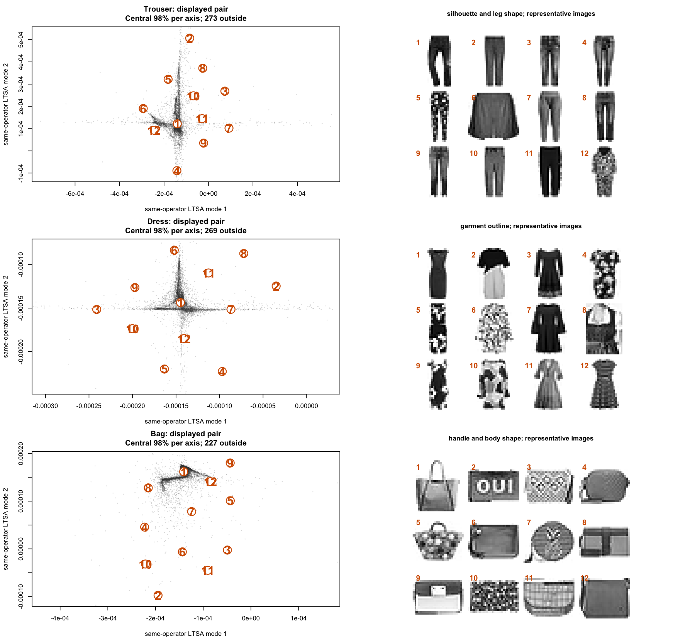

```{r setup, include=FALSE}
knitr::opts_chunk$set(
  collapse = TRUE,
  comment = "#>",
  fig.align = "center",
  fig.width = 11,
  fig.height = 7,
  dev.args = list(bg = "white")
)
library(flotsam)
```

LTSA uses `ndim` twice: once to build the local tangent spaces and again to
choose how many global coordinates to return. Those choices can differ. A
circle is locally one-dimensional, for example, but two coordinates show its
closed path.

`spectral_dim` retains extra coordinates from the same LTSA operator. This
article shows how to inspect them on a circle, COIL-20, MNIST, and
Fashion-MNIST.

## Keep more modes from the same operator

Given a data matrix `X`, request four low-frequency modes while keeping a
two-dimensional local tangent model and a two-coordinate returned embedding:

```r
fit <- ltsa(
  X,
  ndim = 2,
  n_neighbors = 15,
  output = "result",
  spectral_dim = 4
)

dim(fit$embedding)                    # n by 2
dim(fit$spectral_embedding)           # n by 4
identical(
  fit$embedding,
  fit$spectral_embedding[, 1:2, drop = FALSE]
)
```

The calculation follows this pipeline:

```text
data + graph + ndim
        |
        v
  fixed operator B
        |
        v
 eig_k candidate modes
        |
        v
spectral_dim retained modes
        |
        v
 first ndim displayed
```

| Control | Changes `B`? | Purpose |
|---|:---:|---|
| `ndim` | yes | Sets the local tangent rank and displayed prefix |
| `spectral_dim` | no | Retains extra nonconstant modes from the fixed operator |
| `eig_k` | no | Gives the eigensolver a numerical candidate span |

Most users can leave `eig_k` at its default. When retaining an expanded block,
a manual request must be at least `spectral_dim + 2`: one place for the known
constant direction and another for the mode just beyond the retained block.

The displayed and retained boundaries have separate diagnostics:

```r
fit$eigen$diagnostics$scaled_boundary_gap
fit$eigen$spectral$diagnostics$scaled_boundary_gap
fit$eigen$status
fit$eigen$spectral$status
```

A boundary gap compares the last included mode with the next one. A large gap
isolates the chosen subspace. A small gap suggests interpreting the neighboring
modes together and checking their geometry and support.

## A short inspection routine

Three questions organize the diagnostics:

1. **Is the operator structurally sound?** Check graph connectivity and local
   ranks.
2. **Was the spectrum computed reliably?** Check status, messages, and
   residuals.
3. **Is the displayed view well determined and useful?** Check boundary gaps,
   inspect a small retained block, and measure how broadly each mode is
   supported.

When comparing stochastic fits, reuse the same saved neighbor matrix, reset the
eigensolver seed immediately before each fit, and keep thread settings equal.

## A circle needs a spectral pair

A circle has a one-dimensional tangent at every point. A single real-valued
coordinate cannot follow the whole loop continuously, so the first two
low-frequency modes work as a pair. Their signs and orientation can change
between fits; treat the two-dimensional span as the stable unit.

The example uses exact neighbors and dense eigenanalysis, making the repeated
pairs easy to see.

```{r circle-fit}
theta <- seq(0, 2 * pi, length.out = 721)[-721]
circle <- cbind(x = cos(theta), y = sin(theta))

circle_fit <- ltsa(
  circle,
  ndim = 1,
  n_neighbors = 9,
  nn_method = "exact",
  eig_method = "eig",
  eig_k = 8,
  output = "result",
  spectral_dim = 4
)

circle_fit$eigen$values
circle_fit$eigen$spectral$values
circle_fit$eigen$status
circle_fit$eigen$messages
```

```{r circle-figure, echo=FALSE, fig.cap="The input circle, its one-dimensional LTSA display, the first two modes from the same operator, and the low spectrum. The mode pair follows the complete periodic progression."}
circle_colors <- grDevices::hcl.colors(
  nrow(circle),
  palette = "Spectral",
  rev = TRUE
)
circle_values <- circle_fit$eigen$ritz_values[1:5]

old_par <- graphics::par(no.readonly = TRUE)
graphics::par(mfrow = c(2, 2), mar = c(4, 4, 3, 1))

graphics::plot(
  circle,
  col = circle_colors,
  pch = 16,
  cex = 0.55,
  asp = 1,
  xlab = "input coordinate 1",
  ylab = "input coordinate 2",
  main = "Input circle"
)
graphics::plot(
  theta,
  circle_fit$embedding[, 1],
  col = circle_colors,
  pch = 16,
  cex = 0.55,
  xlab = "latent angle",
  ylab = "returned LTSA coordinate",
  main = "One displayed coordinate"
)
graphics::plot(
  circle_fit$spectral_embedding[, 1:2],
  col = circle_colors,
  pch = 16,
  cex = 0.55,
  asp = 1,
  xlab = "LTSA mode 1",
  ylab = "LTSA mode 2",
  main = "The first spectral pair"
)
graphics::plot(
  seq_along(circle_values),
  circle_values,
  type = "b",
  pch = 21,
  bg = c("#D55E00", "#D55E00", rep("grey80", 3)),
  xaxt = "n",
  xlab = "nonconstant Ritz mode",
  ylab = "Ritz value",
  main = "Low spectrum"
)
graphics::axis(1, at = seq_along(circle_values))
graphics::abline(
  v = c(1.5, 2.5, 4.5),
  lty = c(3, 2, 3),
  col = "grey40"
)
graphics::legend(
  "topleft",
  legend = c("displayed 1D", "first pair", "retained 4D"),
  lty = c(3, 2, 3),
  col = "grey40",
  bty = "n",
  cex = 0.75
)
graphics::par(old_par)
```

Setting `ndim = 2` would build a two-dimensional local tangent model. Here,
`spectral_dim = 2` keeps the original one-dimensional model and reveals its
second global coordinate.

## COIL-20: a real periodic example

[COIL-20](https://cave.cs.columbia.edu/repository/COIL-20) contains 72 views of
each object as it rotates. One object traces a closed, locally one-dimensional
curve through pixel space, so the circle example predicts a spectral pair.

At `k = 7`, mixing objects produces a disconnected neighbor graph, so we fit
objects separately. A topology-only screen selected objects 4 and 1: their
graphs are connected and locally cyclic, and they have the two lowest shortcut
rates among the eligible objects. Each fit uses ordinary LTSA with `ndim = 1`,
exact neighbors, and four retained modes. The coordinates come from pixels;
pose supplies the point colors and thumbnail labels.


The gap after mode 2 is much larger than the gap between modes 1 and 2. For
objects 4 and 1, the mode 1--2 gaps are `0.000108` and `0.000181`, while the
mode 2--3 gaps are `0.00250` and `0.00215`---about 23 and 12 times larger. This
is the spectral pattern expected from a mode pair. The second mode completes
the rotational orbit already present in the fixed operator.

## Check whether a mode represents many observations

A low-energy mode can be dominated by a few observations. For a
Euclidean-normalized coordinate vector `v`, the effective support fraction is

$$
\frac{1}{n\sum_i v_i^4}.
$$

This is the normalized participation ratio. It equals $1/n$ when one
observation carries the mode, $r/n$ when the energy is spread equally across
exactly $r$ observations, and 1 when it is spread equally across all
observations. Here, a mode's energy means its squared coordinate values, `v^2`:

```r
effective_support_fraction <- function(v) {
  v <- v / sqrt(sum(v^2))
  1 / (length(v) * sum(v^4))
}
```

This diagnostic measures localization. The plots then show what the broadly
supported coordinates represent.

## MNIST: a complementary view

The 7,877 MNIST digit-1 images show how localization changes the interpretation
of extra modes. Ordinary and normalized LTSA use the same saved neighbor
matrix, `ndim = 2`, `k = 15`, and four retained modes. Normalized LTSA changes
the weighting through a generalized eigenproblem, giving a distinct estimator
over the same graph.

The ordinary first three modes are concentrated on individual observations.
Normalized modes 1 and 2 are broadly supported and arrange handwriting by
slant, curvature, stroke width, hooks, and serifed or branched forms.


Modes 2 and 3 give another view of the same morphology. Mode 3 has less support,
so this pair works best as a complementary diagnostic view.


The numbered representatives cover the central 98% of each plot axis. Starting
near the plot center, the selection repeatedly chooses the image farthest from
those already shown. This gives a compact tour of the central region.

## Fashion-MNIST: a localized spectral block

Fashion-MNIST shows how a retained block can diagnose localization. We fit
trousers, dresses, and bags separately with ordinary LTSA, using `ndim = 2`,
`k = 15`, and four retained modes. Each class uses one saved
approximate-neighbor graph.

Across the three classes, all twelve retained coordinates lie near the
single-observation support limit, and the largest 1% of observations carry more
than 99.96% of each coordinate's energy. The graphs are connected, local
patches have full rank, and the eigensolves converge. The support plot
identifies localization throughout the retained four-mode blocks.


The image panels provide visual context for the displayed pairs. Their star-like
clouds reflect the same concentration measured across all four modes.



The eigengap describes boundary stability; support describes how global the
returned modes are. Fashion-MNIST has weak boundaries, and all four retained
modes in each class are localized.

## What to carry into practice

The circle and COIL-20 show the clearest use: a locally one-dimensional closed
path appears as a pair in the low-frequency block. MNIST shows how normalized
LTSA can produce a coherent complementary view, with support deciding how much
weight to place on each coordinate. Fashion-MNIST shows that the retained
four-mode ordinary-LTSA blocks can themselves be localized.

Use `spectral_dim` when topology or a weak boundary gives you a reason to look
past the displayed prefix. Read the block together with connectivity, rank,
solver, gap, and support diagnostics. For details of the returned fields, see
[Numerical diagnostics and solver notes](numerical-diagnostics.html).

Retaining a block supplies candidate coordinates; choosing which coordinates
to display is a separate problem. [Independent Eigencoordinate
Selection](https://proceedings.neurips.cc/paper_files/paper/2019/file/6a10bbd480e4c5573d8f3af73ae0454b-Paper.pdf)
is one approach that searches a larger spectral set for smooth, locally
independent coordinates. `spectral_dim` supplies the modes needed to investigate
that question.

## Reproduce the real-data examples

The complete script downloads the datasets with `snedata`, reuses saved
neighbor matrices for estimator comparisons, fits the retained blocks, and
draws the thumbnail and support plots. Install its extra dependencies with
`pak::pak("jlmelville/snedata")` and `install.packages("rnndescent")`.

```{r reproduction-code, echo=FALSE, results="asis"}
script_path <- file.path(
  dirname(knitr::current_input(dir = TRUE)),
  "spectral-blocks-reproduction.R"
)
script <- paste(readLines(script_path, warn = FALSE), collapse = "\n")
cat(
  "<details><summary>Show the complete data and plotting script ",
  "(downloads three image datasets)</summary>",
  "<pre><code class=\"language-r\">",
  htmltools::htmlEscape(script),
  "</code></pre></details>",
  sep = "\n"
)
```

## Data sources

The image examples use [COIL-20](https://cave.cs.columbia.edu/repository/COIL-20)
(Sameer A. Nene, Shree K. Nayar, and Hiroshi Murase),
[MNIST](https://yann.lecun.com/exdb/mnist/) (Yann LeCun, Corinna Cortes, and
Christopher J. C. Burges), and
[Fashion-MNIST](https://arxiv.org/abs/1708.07747) (Han Xiao, Kashif Rasul, and
Roland Vollgraf).
